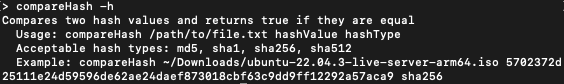

# CompareHash

## Screenshot



## Description

It is crucial to verify the integrity of download files. CompareHash provides a means for generating the hash of a file and verifying it in a single command with a straight forward syntax regardless of your OS. On Linux and MacOS machines, hashing is handled by the Operating System with a call to the [OpenSSL library](https://www.openssl.org/). On Windows machines, the OS provided [cmdlet](https://learn.microsoft.com/en-us/powershell/module/microsoft.powershell.utility/get-filehash?view=powershell-7.4) Get-FileHash is used.

## Installation

### Clone the Repo

Navigate to a folder of your choosing in the terminal and clone the repository:

```bash
git clone https://github.com/iiTONELOC/compare-hash.git
```

### Linux/MacOs

#### Configure an Alias

Update the bashrc file to add the alias, I have gone with compareHash but you can name it whatever you would like!

```bash
nano ~/.bashrc

#if Mac or using Zsh
nano ~./zshrc

# Then add your alias to the bottom of the file using the following syntax
alias <aliasName>="</path/to/compareHash.sh>"


# Save the file and close it, then type the following in the terminal to make the alias available in the current session
source ~/.bashrc

# or if using Zsh
source ~/.zshrc
```

`You can now access compareHash.sh using your <aliasName>!`

### Windows

A Powershell script has been provided that creates a function called CompareHash and appends it to the user's powershell profile. A profile is created if it does not yet exist.

#### Set Execution Policy

Default Powershell settings forbid executing local scripts. To install, the execution policy needs to be changed to `Unrestricted`. Start Powershell as an Administrator and run the following command:

```bash
Set-ExecutionPolicy Unrestricted
```

#### Execute the Install Script

```bash
.\AddCompareHash.ps1

# Reload the profile

. $PROFILE
```

## Usage

### On Linux/MacOs

Integrity can be verified using the following command syntax compareHash `/path/to/file <ListedHashFromWebSite> <algorithm>`.

Here is an example command verifying against the compareHash.sh file:

```bash
compareHash ~/path/to/compareHash.sh bdfff66afcce77d2d40e37a873b8e4b617e5d0f7cfb2aa9fc26b948f52429d93 sha256
True # Expected Output
```

### On Windows

The usage is the same as Linux/MacOs, except the name is CompareHash rather than compareHash therefore the syntax is CompareHash `\path	oile <ListedHashFromWebSite> <algorithm>`

Here is an example of verifying a SHA256 hash for the AddCompareHash PowerShell Script:

```bash
CompareHash ~\path\to\AddCompareHash.ps1 c52caa2667d3f328ec80a92601b8b97ffd48db5055ba7896ee01ed4ef4ff3d1e sha256
True #Expected Output
```

### Currently Supported Hash Types

`Hash Type: Expected Argument`

- `MD5: md5`
- `SHA-1: sha1`
- `SHA-256: sha256`
- `SHA-512: sha512`

### Help

Help can be accessed by using the -h flag or using --help.

## LICENSE

This project is licensed with an MIT license [which can be viewed here](./LICENSE)

